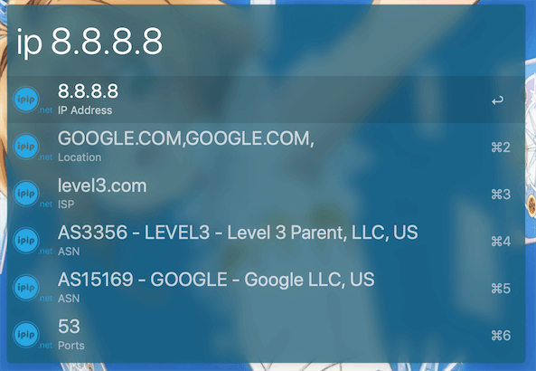
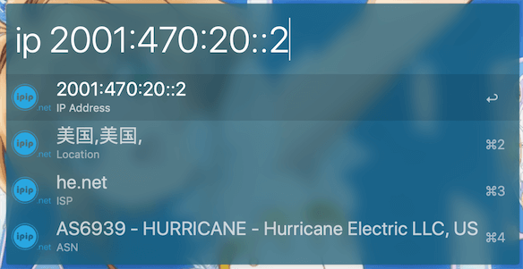

IPIP.net workflow ([Download v1.00](https://raw.github.com/TinkoLiu/alfred-ipip-workflow/master/ipip.alfredworkflow))
=====================

Alfred App Workflow for IPIP.net

## Requirements
1. [Alfred App v3](http://www.alfredapp.com/#download)
1. [Alfred Powerpack](https://buy.alfredapp.com/)

## Installing
1. Download the workflow
2. Double-click to import into Alfred
3. Use with keywork `ip`

## About
Alfred App Workflow for IPIP.net

## Commands
- `ip {query}`

This workflow accepts **domain name**, **IPv4**, **IPv6**.

If you input **domain name**, it will resolve it and let you choose a IP address from a list.

## Tips
If you want change the result text language:

1. Import the workflow, open Alfred Prefrences and find it
2. Double click the `Script Filter`
3. Change the language setting in **Line #7**